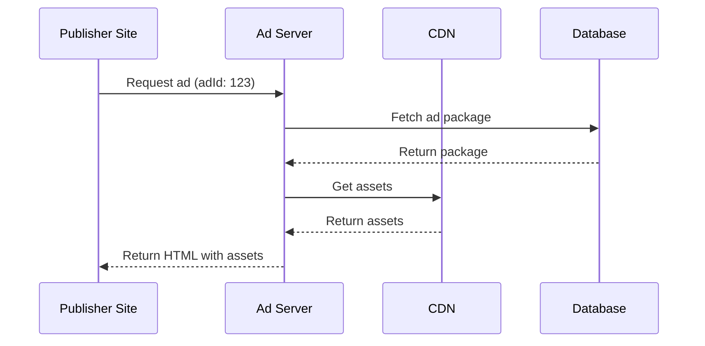

# Using iFrames in React/TypeScript

See the [official Mozilla documentation](https://developer.mozilla.org/en-US/docs/Web/HTML/Element/iframe) for more information on iframes.

The introduction says: *The ```<iframe>``` HTML element represents a nested browsing context, embedding another HTML page into the current one.*

There are a large number of attributes available.

- `allow` - Specifies a list of feature policies (e.g., `"fullscreen; microphone"`).
- `allowfullscreen` - Enables fullscreen mode (`"true"` or `"false"`).
- `height` - Defines the height of the iframe (e.g., `"600px"` or `"100%"`).
- `width` - Defines the width of the iframe (e.g., `"800px"` or `"100%"`).
- `loading` - Specifies lazy loading behavior (`"lazy"` or `"eager"`).
- `name` - Assigns a name to the iframe (e.g., `"myFrame"`).
- `referrerpolicy` - Controls referrer information (`"no-referrer"`, `"origin"`).
- `sandbox` - Applies restrictions (`"allow-scripts allow-same-origin"`, etc.).
- `src` - Specifies the URL of the embedded page (e.g., `"https://example.com"`).
- `srcdoc` - Defines inline HTML content for the iframe.
- `frameborder` (deprecated) - Specifies border size (`"0"` or `"1"`).

## Ads in iFrames

This guide covers best practices for implementing ads using iFrames in a React/TypeScript context.
It covers the following topics:

- Security
- Performance
- Error Handling
- Usage Example
- Lazy Loading Implementation

Additional Considerations

- Accessibility
- Analytics
- Responsive Design
- Ad Blocking Detection

## Basic Ad Component

Here's a reusable Ad Component with TypeScript typing:

```typescript
interface AdProps {
  adUrl: string;
  width?: number;
  height?: number;
  title?: string;
  className?: string;
  onLoad?: () => void;
  onError?: (error: Error) => void;
}

const AdFrame: React.FC<AdProps> = ({
  adUrl,
  width = 300,
  height = 250,
  title = "Advertisement",
  className,
  onLoad,
  onError
}) => {
  const iframeRef = useRef<HTMLIFrameElement>(null);

  useEffect(() => {
    const handleLoad = () => {
      onLoad?.();
    };

    const handleError = (error: ErrorEvent) => {
      onError?.(error.error);
    };

    const iframe = iframeRef.current;
    if (iframe) {
      iframe.addEventListener('load', handleLoad);
      iframe.addEventListener('error', handleError);
    }

    return () => {
      if (iframe) {
        iframe.removeEventListener('load', handleLoad);
        iframe.removeEventListener('error', handleError);
      }
    };
  }, [onLoad, onError]);

  return (
    <iframe
      ref={iframeRef}
      src={adUrl}
      width={width}
      height={height}
      title={title}
      className={className}
      frameBorder="0"
      scrolling="no"
      sandbox="allow-scripts allow-same-origin allow-popups"
    />
  );
};
```

## Key Best Practices

### 1. Security

- Use the `sandbox` attribute with specific permissions
- Only load ads from trusted sources
- Implement Content-Security-Policy headers

### 2. Performance

- Lazy load ads below the fold
- Specify width and height to prevent layout shifts
- Use `loading="lazy"` attribute for below-fold ads

### 3. Error Handling

Implement an error boundary:

```typescript
const AdWithErrorBoundary: React.FC<AdProps> = (props) => {
  return (
    <ErrorBoundary fallback={<div>Ad failed to load</div>}>
      <AdFrame {...props} />
    </ErrorBoundary>
  );
};
```

Usage Example

```typescript
const HomePage: React.FC = () => {
  const handleAdLoad = () => {
    console.log('Ad loaded successfully');
  };

  const handleAdError = (error: Error) => {
    console.error('Ad failed to load:', error);
  };

  return (
    <AdFrame
      adUrl="https://trusted-ad-server.com/ad"
      width={300}
      height={250}
      onLoad={handleAdLoad}
      onError={handleAdError}
    />
  );
};
```

### 4. Lazy Loading Implementation

```typescript
const LazyAdFrame = lazy(() => import('./AdFrame'));

const PageWithLazyAd: React.FC = () => {
  return (
    <Suspense fallback={<div>Loading ad...</div>}>
      <LazyAdFrame adUrl="https://trusted-ad-server.com/ad" />
    </Suspense>
  );
};
```

## Additional Considerations

### Accessibility

- Use proper ARIA attributes
- Provide meaningful iframe titles
- Implement skip-ad functionality where appropriate

### Analytics

- Track ad impressions
- Monitor loading performance
- Implement error tracking

### Responsive Design

```typescript
const ResponsiveAd: React.FC<AdProps> = (props) => {
  const [dimensions, setDimensions] = useState({ width: 300, height: 250 });

  useEffect(() => {
    const handleResize = () => {
      // Adjust dimensions based on viewport
      const newDimensions = calculateAdDimensions(window.innerWidth);
      setDimensions(newDimensions);
    };

    window.addEventListener('resize', handleResize);
    return () => window.removeEventListener('resize', handleResize);
  }, []);

  return <AdFrame {...props} {...dimensions} />;
};
```

### Ad Blocking Detection

```typescript
const useAdBlockDetection = () => {
  const [isBlocked, setIsBlocked] = useState(false);

  useEffect(() => {
    const checkAdBlocker = async () => {
      try {
        // Attempt to load a test ad
        const response = await fetch('https://your-ad-server.com/test');
        setIsBlocked(!response.ok);
      } catch {
        setIsBlocked(true);
      }
    };

    checkAdBlocker();
  }, []);

  return isBlocked;
};
```

## Important Reminders

- Always comply with ad network policies
- Follow privacy regulations
- Implement proper ad refresh mechanisms
- Clean up event listeners and subscriptions on component unmount

## Other options

Since iframe is a nested full-fledged document, it does not expect children.

ReactPortal can be used to render something virtually at one location and actually render at another.

```js
function IFrame({ children }) {
  const [ref, setRef] = useState();
  const container = ref?.contentWindow?.document?.body;

  return (
    <iframe ref={setRef}>
      {container && createPortal(children, container)}
    </iframe>
  );
}

function RenderingInIFrame() {
  return (
    <IFrame>
      <MyComponent />
    </IFrame>
  );
}
```

[Source](https://dev.to/graftini/rendering-in-an-iframe-in-a-react-app-2boa)

## An expandable iframe that opens into a modal carousel

```js
interface ExpandableAdProps extends AdProps {
  carouselImages: string[];
  modalWidth?: number;
  modalHeight?: number;
}

const ExpandableAdFrame: React.FC<ExpandableAdProps> = ({
  carouselImages,
  modalWidth = 800,
  modalHeight = 600,
  ...adProps
}) => {
  const [isModalOpen, setIsModalOpen] = useState(false);
  const [currentSlide, setCurrentSlide] = useState(0);

  const handleAdClick = () => {
    setIsModalOpen(true);
  };

  const handleClose = () => {
    setIsModalOpen(false);
    setCurrentSlide(0);
  };

  const nextSlide = () => {
    setCurrentSlide((prev) => (prev + 1) % carouselImages.length);
  };

  const prevSlide = () => {
    setCurrentSlide((prev) => 
      prev === 0 ? carouselImages.length - 1 : prev - 1
    );
  };

  return (
    <>
      <div 
        onClick={handleAdClick} 
        style={{ cursor: 'pointer' }}
      >
        <AdFrame {...adProps} />
      </div>

      {isModalOpen && (
        <div className="modal-overlay" 
          style={{
            position: 'fixed',
            top: 0,
            left: 0,
            right: 0,
            bottom: 0,
            backgroundColor: 'rgba(0, 0, 0, 0.75)',
            display: 'flex',
            justifyContent: 'center',
            alignItems: 'center',
            zIndex: 1000
          }}
        >
          <div className="modal-content"
            style={{
              width: modalWidth,
              height: modalHeight,
              backgroundColor: 'white',
              borderRadius: '8px',
              position: 'relative'
            }}
          >
            <button 
              onClick={handleClose}
              style={{
                position: 'absolute',
                right: '10px',
                top: '10px',
                zIndex: 1
              }}
            >
              ✕
            </button>

            <div className="carousel"
              style={{
                height: '100%',
                position: 'relative',
                overflow: 'hidden'
              }}
            >
              <div 
                style={{
                  display: 'flex',
                  transform: `translateX(-${currentSlide * 100}%)`,
                  transition: 'transform 0.3s ease-in-out'
                }}
              >
                {carouselImages.map((image, index) => (
                  
                ))}
              </div>

              <button 
                onClick={prevSlide}
                style={{
                  position: 'absolute',
                  left: '10px',
                  top: '50%',
                  transform: 'translateY(-50%)'
                }}
              >
                ←
              </button>

              <button 
                onClick={nextSlide}
                style={{
                  position: 'absolute',
                  right: '10px',
                  top: '50%',
                  transform: 'translateY(-50%)'
                }}
              >
                →
              </button>
            </div>
          </div>
        </div>
      )}
    </>
  );
};
```

For better styling and animations, you might want to use a CSS-in-JS solution or separate CSS file. Here's an example with styled-components:

```js
import styled from 'styled-components';

const ModalOverlay = styled.div`
  position: fixed;
  top: 0;
  left: 0;
  right: 0;
  bottom: 0;
  background-color: rgba(0, 0, 0, 0.75);
  display: flex;
  justify-content: center;
  align-items: center;
  z-index: 1000;
  animation: fadeIn 0.3s ease-in-out;

  @keyframes fadeIn {
    from { opacity: 0; }
    to { opacity: 1; }
  }
`;

const ModalContent = styled.div`
  width: ${props => props.width}px;
  height: ${props => props.height}px;
  background-color: white;
  border-radius: 8px;
  position: relative;
  animation: scaleIn 0.3s ease-in-out;

  @keyframes scaleIn {
    from {
      transform: scale(0.8);
      opacity: 0;
    }
    to {
      transform: scale(1);
      opacity: 1;
    }
  }
`;

const CarouselButton = styled.button`
  background: rgba(255, 255, 255, 0.8);
  border: none;
  border-radius: 50%;
  width: 40px;
  height: 40px;
  cursor: pointer;
  display: flex;
  align-items: center;
  justify-content: center;
  transition: background-color 0.2s;

  &:hover {
    background: rgba(255, 255, 255, 1);
  }
`;
```

## The sandbox attribute

The sandbox attribute is used to allow or restrict the content in an iframe.

Various scenarios for attribute values could include:

## Ad Tech Platform Deployment Architecture

### 1. Ad Server Infrastructure

- Main ad server (ad-tech1.example) hosts the core ad serving logic
- Content Delivery Network (CDN) for fast ad delivery
- Load balancers for high availability

### 2. Ad Package Structure

```html
<!-- Publisher site embed code -->
<iframe 
  src="https://ad-tech1.example/ads/embed/123"
  width="300"
  height="250"
  frameborder="0"
  scrolling="no"
  sandbox="allow-scripts allow-same-origin allow-popups"
></iframe>
```

### 3. Deployment Components

#### A. Ad Creative Package

```javascript
// Example ad creative structure
{
  "adId": "123",
  "creative": {
    "type": "banner",
    "content": {
      "html": "<div>Ad content</div>",
      "css": "styles.css",
      "js": "ad.js"
    },
    "assets": [
      "images/logo.png",
      "videos/preview.mp4"
    ]
  },
  "tracking": {
    "impression": "https://ad-tech1.example/track/imp/123",
    "click": "https://ad-tech1.example/track/click/123"
  }
}
```

### B. Delivery Pipeline

1. **Build Process**

   - Minify CSS/JS
   - Optimize images
   - Package assets
   - Generate unique ad IDs

2. **Deployment Flow**

   ```mermaid
   graph LR
   A[Ad Creative] --> B[Build Process]
   B --> C[CDN Upload]
   C --> D[Ad Server Update]
   D --> E[Publisher Sites]
   ```

3. **Version Control**
   - Each ad version gets unique identifier
   - A/B testing support
   - Rollback capability

### 4. Security Measures

#### A. Iframe Security

```html
<!-- Secure iframe configuration -->
<iframe
  sandbox="allow-scripts allow-same-origin allow-popups"
  referrerpolicy="no-referrer"
  loading="lazy"
></iframe>
```

### B. Content Security Policy

```http
Content-Security-Policy: 
  default-src 'self';
  script-src 'self' 'unsafe-inline' 'unsafe-eval';
  style-src 'self' 'unsafe-inline';
  img-src 'self' data: https:;
  frame-ancestors https://*.publisher.com;
```

### 5. Performance Optimization

#### A. Lazy Loading

```javascript
// Publisher implementation
const adFrame = document.createElement('iframe');
adFrame.loading = 'lazy';
adFrame.src = 'https://ad-tech1.example/ads/embed/123';
```

### B. Resource Loading

```javascript
// Ad creative loading strategy
const loadAd = async () => {
  // Load critical CSS first
  await loadCSS('critical.css');
  
  // Load main content
  await loadHTML('ad.html');
  
  // Load non-critical assets
  loadAssets('images/*');
};
```

### 6. Monitoring and Analytics

#### A. Performance Metrics

```javascript
// Ad performance tracking
const metrics = {
  loadTime: performance.now() - startTime,
  viewability: calculateViewability(),
  interaction: trackUserInteraction()
};
```

### B. Error Handling

```javascript
// Error tracking
window.onerror = (msg, url, line) => {
  reportError({
    adId: currentAdId,
    error: msg,
    location: url,
    line: line
  });
};
```

## 7. Deployment Best Practices

1. **Staging Environment**
   - Test ads in controlled environment
   - Validate creative rendering
   - Check performance metrics

2. **Rollout Strategy**
   - Gradual deployment (percentage-based)
   - Geographic targeting
   - Publisher-specific testing

3. **Monitoring**
   - Real-time performance tracking
   - Error rate monitoring
   - User interaction analytics

4. **Compliance**
   - GDPR/CCPA compliance
   - Ad blocking detection
   - Privacy policy adherence

## 8. Example Deployment Script

```bash
#!/bin/bash
# Deploy ad creative

# Build assets
npm run build

# Upload to CDN
aws s3 sync ./dist s3://ad-tech1-cdn/ads/

# Update ad server
curl -X POST https://ad-tech1.example/api/ads/update \
  -H "Content-Type: application/json" \
  -d '{"adId": "123", "version": "1.0.0"}'

# Verify deployment
curl https://ad-tech1.example/health/check
```

Remember:

- Always use HTTPS
- Implement proper error handling
- Monitor performance metrics
- Follow security best practices
- Maintain version control
- Test thoroughly before deployment

## GDPR/CCPA Compliance in Ad Tech

### GDPR (General Data Protection Regulation)

#### Key Requirements

1. **User Consent**
   - Must obtain explicit consent before collecting data
   - Consent must be freely given, specific, informed, and unambiguous
   - Must provide clear opt-out mechanisms

2. **Data Collection**
   - Only collect data necessary for specific purposes
   - Must document what data is collected and why
   - Must implement data minimization

3. **User Rights**
   - Right to access their data
   - Right to be forgotten
   - Right to data portability
   - Right to object to processing

### Implementation Example

```javascript
// Consent management
const consentManager = {
  // Check if user has given consent
  hasConsent: () => {
    return localStorage.getItem('adConsent') === 'true';
  },

  // Store user consent
  setConsent: (consent) => {
    localStorage.setItem('adConsent', consent);
    // Update ad serving based on consent
    updateAdServing(consent);
  },

  // Handle data deletion request
  handleDeletionRequest: async (userId) => {
    // Delete user data across all systems
    await deleteUserData(userId);
    // Confirm deletion
    return { status: 'success', message: 'Data deleted' };
  }
};
```

## CCPA (California Consumer Privacy Act)

### Key Requirements for CCPA

1. **Consumer Rights**
   - Right to know what data is collected
   - Right to know whether data is sold or disclosed
   - Right to say no to data sales
   - Right to access their data

2. **Business Obligations**
   - Must provide notice at collection
   - Must maintain records of data sales
   - Must implement reasonable security measures

### Implementation Example

```javascript
// CCPA compliance handler
const ccpaHandler = {
  // Track data collection
  trackDataCollection: (dataType) => {
    const collectionLog = {
      timestamp: new Date(),
      dataType,
      purpose: 'advertising'
    };
    // Store collection record
    storeCollectionRecord(collectionLog);
  },

  // Handle opt-out requests
  handleOptOut: async (userId) => {
    // Stop data collection
    stopDataCollection(userId);
    // Remove from data sales
    removeFromDataSales(userId);
    // Confirm opt-out
    return { status: 'success', message: 'Opt-out processed' };
  }
};
```

## Common Implementation Requirements

### 1. Consent Management

```javascript
// Consent banner implementation
const ConsentBanner = () => {
  return (
    <div className="consent-banner">
      <p>We use cookies and similar technologies to improve your browsing experience.</p>
      <button onClick={() => consentManager.setConsent(true)}>
        Accept
      </button>
      <button onClick={() => consentManager.setConsent(false)}>
        Decline
      </button>
    </div>
  );
};
```

### 2. Data Collection Logging

```javascript
// Data collection logger
const dataLogger = {
  logCollection: (data) => {
    const log = {
      timestamp: new Date(),
      dataType: data.type,
      purpose: data.purpose,
      consentStatus: consentManager.hasConsent()
    };
    // Store log securely
    storeLog(log);
  }
};
```

### 3. User Data Management

```javascript
// User data manager
const userDataManager = {
  // Get user data
  getUserData: async (userId) => {
    const data = await fetchUserData(userId);
    return formatUserData(data);
  },

  // Delete user data
  deleteUserData: async (userId) => {
    // Delete from all systems
    await Promise.all([
      deleteFromAdServer(userId),
      deleteFromAnalytics(userId),
      deleteFromCRM(userId)
    ]);
  }
};
```

## Best Practices

1. **Transparency**
   - Clear privacy policy
   - Detailed data collection notices
   - Easy-to-understand consent options

2. **Security**
   - Encrypt sensitive data
   - Implement access controls
   - Regular security audits

3. **Documentation**
   - Maintain records of consent
   - Document data flows
   - Keep audit trails

4. **Regular Updates**
   - Review compliance regularly
   - Update policies as needed
   - Monitor regulatory changes

## Implementation Checklist

- [ ] Implement consent management system
- [ ] Create privacy policy
- [ ] Set up data collection logging
- [ ] Implement user data access/deletion
- [ ] Create opt-out mechanisms
- [ ] Set up security measures
- [ ] Document data flows
- [ ] Create audit system
- [ ] Train staff on compliance
- [ ] Regular compliance reviews

Remember:

- Keep detailed records
- Implement proper security measures
- Make compliance features easily accessible
- Regular updates and reviews
- Document all compliance-related actions

# Ad Creative Package to Publisher Flow

## 1. Publisher Embed Code
```html
<!-- Publisher site embed code -->
<iframe 
  src="https://ad-tech1.example/ads/embed/123"
  width="300"
  height="250"
  frameborder="0"
  scrolling="no"
  sandbox="allow-scripts allow-same-origin allow-popups"
></iframe>
```

## 2. Flow Process

1. **Initial Request**
   - Publisher's iframe loads with ad ID (123)
   - Makes request to ad-tech1.example/ads/embed/123

2. **Ad Server Processing**
```javascript
// Ad server endpoint handling
app.get('/ads/embed/:adId', async (req, res) => {
  const adId = req.params.adId;
  
  // Fetch ad creative package
  const adPackage = await fetchAdPackage(adId);
  
  // Generate HTML response
  const html = generateAdHTML(adPackage);
  
  res.send(html);
});
```

3. **HTML Generation**
```javascript
function generateAdHTML(adPackage) {
  return `
    <!DOCTYPE html>
    <html>
      <head>
        <style>${adPackage.creative.content.css}</style>
      </head>
      <body>
        ${adPackage.creative.content.html}
        <script>
          // Load tracking pixels
          loadTrackingPixels(adPackage.tracking);
          
          // Load additional assets
          loadAssets(${JSON.stringify(adPackage.creative.assets)});
        </script>
      </body>
    </html>
  `;
}
```

## 3. Complete Flow



## 4. Implementation Details

### A. Ad Package Structure
```javascript
{
  "adId": "123",
  "creative": {
    "type": "banner",
    "content": {
      "html": "<div>Ad content</div>",
      "css": "styles.css",
      "js": "ad.js"
    },
    "assets": [
      "images/logo.png",
      "videos/preview.mp4"
    ]
  },
  "tracking": {
    "impression": "https://ad-tech1.example/track/imp/123",
    "click": "https://ad-tech1.example/track/click/123"
  }
}
```

### B. Asset Loading
```javascript
// Asset loader in ad iframe
function loadAssets(assets) {
  assets.forEach(asset => {
    if (asset.endsWith('.css')) {
      loadCSS(asset);
    } else if (asset.endsWith('.js')) {
      loadJS(asset);
    } else if (asset.match(/\.(png|jpg|gif|mp4)$/)) {
      loadMedia(asset);
    }
  });
}
```

### C. Tracking Implementation
```javascript
// Tracking handler
function loadTrackingPixels(tracking) {
  // Load impression pixel
  const img = new Image();
  img.src = tracking.impression;
  
  // Set up click tracking
  document.addEventListener('click', () => {
    const clickImg = new Image();
    clickImg.src = tracking.click;
  });
}
```

## 5. Security Considerations

### A. Content Security
```http
Content-Security-Policy: 
  default-src 'self';
  script-src 'self' 'unsafe-inline' 'unsafe-eval';
  style-src 'self' 'unsafe-inline';
  img-src 'self' data: https:;
  frame-ancestors https://*.publisher.com;
```

### B. Asset Validation
```javascript
function validateAsset(asset) {
  // Check file type
  const allowedTypes = ['.css', '.js', '.png', '.jpg', '.gif', '.mp4'];
  if (!allowedTypes.some(type => asset.endsWith(type))) {
    throw new Error('Invalid asset type');
  }
  
  // Check file size
  if (getAssetSize(asset) > MAX_ASSET_SIZE) {
    throw new Error('Asset too large');
  }
}
```

## 6. Performance Optimization

### A. Asset Loading Strategy
```javascript
// Progressive loading
async function loadAdContent(adPackage) {
  // Load critical CSS first
  await loadCSS(adPackage.creative.content.css);
  
  // Load main content
  document.body.innerHTML = adPackage.creative.content.html;
  
  // Load non-critical assets
  loadAssets(adPackage.creative.assets);
}
```

### B. Caching Strategy
```javascript
// Cache headers for assets
app.get('/assets/:assetId', (req, res) => {
  res.setHeader('Cache-Control', 'public, max-age=31536000');
  res.sendFile(getAssetPath(req.params.assetId));
});
```

Remember:
- Keep ad packages lightweight
- Implement proper error handling
- Use CDN for asset delivery
- Monitor performance metrics
- Implement proper security measures
